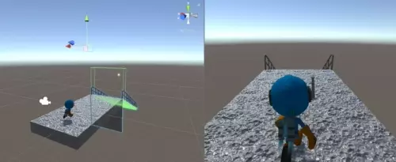
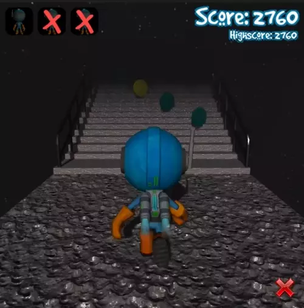

# Endless Runner

In space, no-one can hear you. (Actual fact.)

This project implements an endless runner game by following and extending on the ideas
in the [Create a 3D Endless Runner from Scratch in Unity](https://www.udemy.com/course/endlessrunner/) Udemy course.

I have to say that while following the course was a really good learning experience,
the coding style in the lectures is just horrible. So ... better to follow the course in space.

Since I'm still learning Unity at this point and am not aware of Unity-specific best
practices, I'm not sure if I'm was doing the right thing here when trying to keep or 
save my sanity.
Also, some of the bugs - such as being able to jump multiple times, or being able to cancel the dying animation through jumping - are not fixed here.
Anyway, maybe someone does find this project helpful regardless of that.

## Implementation

Core ideas:

- Tiles are being spawned by a "virtual character" moving ahead of the player.
- The player isn't moving horizontally at all, the world is.
- Platforms are spawned from an object pool and everything behind the player is recycled immediately.

This project uses:

- Object pooling,
- The animation system with blended animations,
- Animation triggers (shooting magic, footstep sounds, ...),
- A bunch of particle systems,
- Overlapping colliders with initially deactivated physics for exploding wall bricks.

The following video shows the continuous world generation by using physics
collisions triggers:

Here's some gameplay footage:

A platform prefab showing the triggers used for spawning new platforms
ahead of the player:

One of the bigger obstacles in the game, the wall, being blasted away
by the magic spell projectile:

